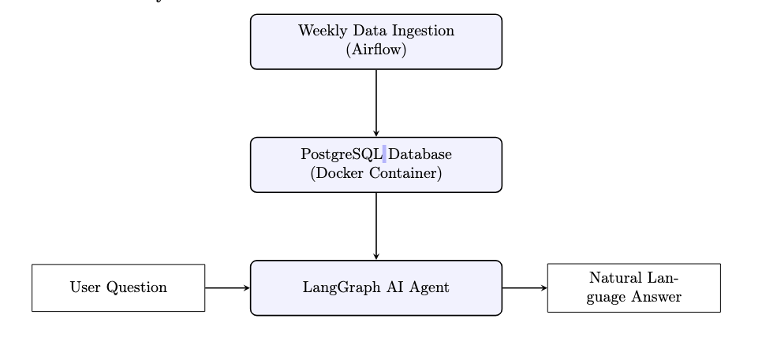
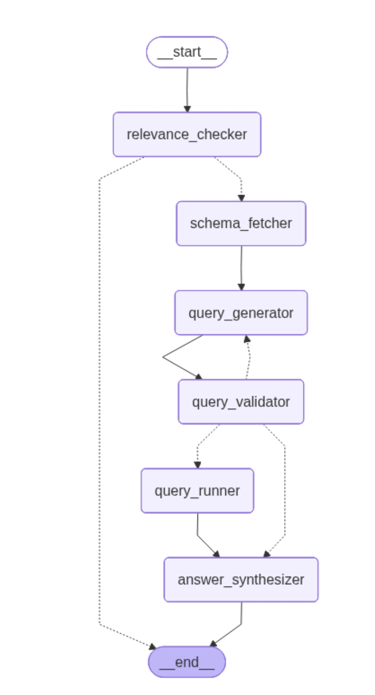

# Chicago Crime SQL Agent

**Ask questions about Chicago crime data in plain English — and get real answers backed by data.**

Live demo → [text2sql.vigneshwarr.com](https://text2sql.vigneshwarr.com)

---

## What it does

You type a question like *"Which district had the most arrests in 2023?"* and the agent figures out the SQL, runs it against the database, and replies in plain English. You can also peek at the SQL query and raw results if you're curious.

---

## How it works

Chicago crime records (2020–present, ~7 million rows) are ingested weekly into a PostgreSQL database via Airflow. When you ask a question, an AI agent powered by Groq's LLaMA 3.3 70B model translates it into SQL, runs it, and explains what it found.



---

## Agent Pipeline

The agent doesn't just blindly ask the LLM for SQL — it runs through a structured pipeline to make sure the answer is accurate and safe.



| Step | What happens |
|------|-------------|
| **Relevance Check** | Filters out off-topic questions (math, trivia, etc.) before wasting API calls |
| **Schema Fetch** | Reads the live database structure so the LLM knows exactly what columns exist |
| **Generate Query** | LLM writes a SQL query tailored to the question |
| **Validate Query** | Checks for syntax errors and blocks any data-modifying statements — retries up to 3× |
| **Run Query** | Executes the validated SQL against PostgreSQL |
| **Synthesize Answer** | LLM reads the results and writes a plain-English summary |

---

## Tech Stack

| | |
|--|--|
| **LLM** | Groq — LLaMA 3.3 70B |
| **Agent framework** | LangGraph (Python) |
| **Web app** | Next.js 14, React, Tailwind CSS |
| **Database** | PostgreSQL (~7M rows) |
| **Data pipeline** | Apache Airflow (weekly ingestion) |
| **Deployment** | Docker, Cloudflare Tunnel |

---

## Running Locally

**You'll need:** Node 20+, a PostgreSQL instance with the `chicago_crime` database, and a [Groq API key](https://console.groq.com).

```bash
cd web
cp .env.example .env.local
# Add your GROQ_API_KEY and DATABASE_URL to .env.local

npm install
npm run dev
# Open http://localhost:3000
```

---

## Evaluation

The agent was tested against 100 hand-labelled questions across three difficulty levels.

| Difficulty | v1 | v2 (current) |
|------------|-----|--------------|
| Easy (40 questions) | 82% | 92% |
| Medium (40 questions) | 60% | 75% |
| Hard (20 questions) | 35% | 50% |
| **Overall** | **62%** | **74%** |

The biggest gains in v2 came from smarter retry logic and stricter validation before executing queries.

---

## Dataset

[Chicago Crimes 2020–Present](https://data.cityofchicago.org/) — City of Chicago open data portal.
